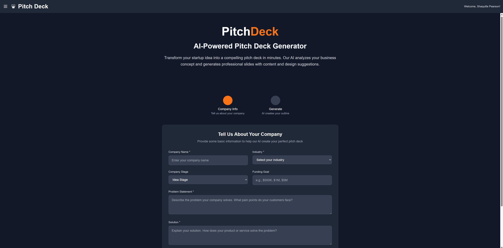
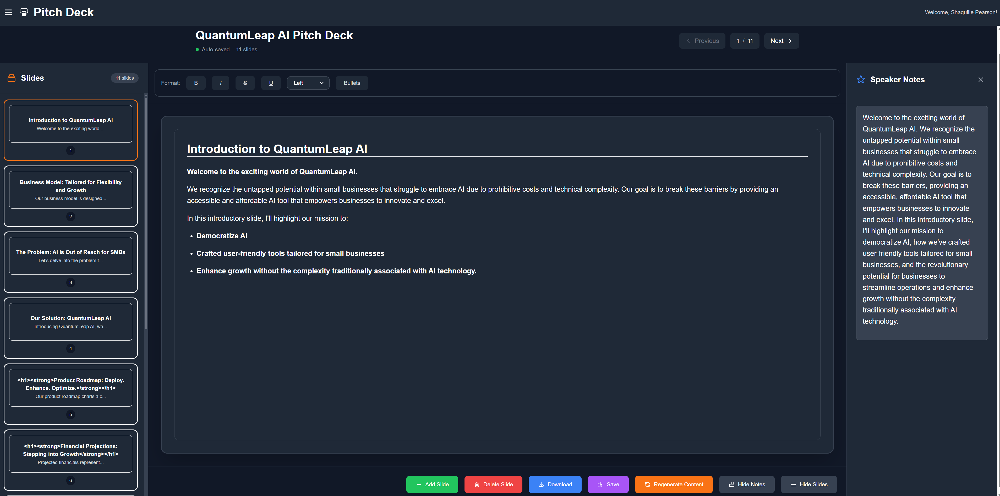
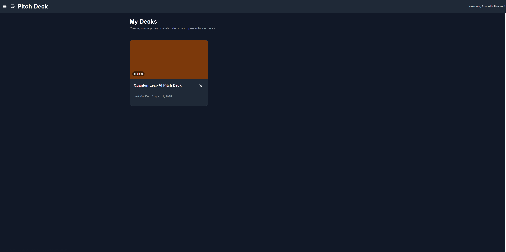
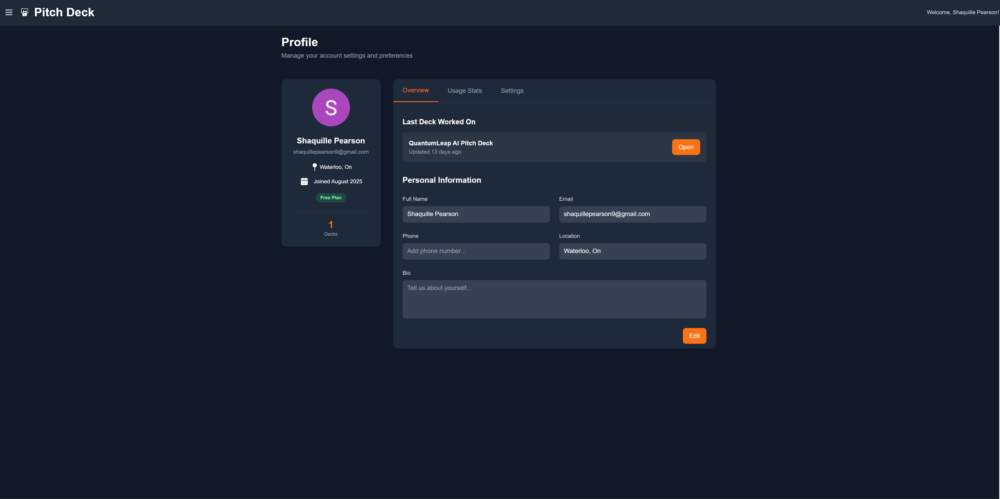
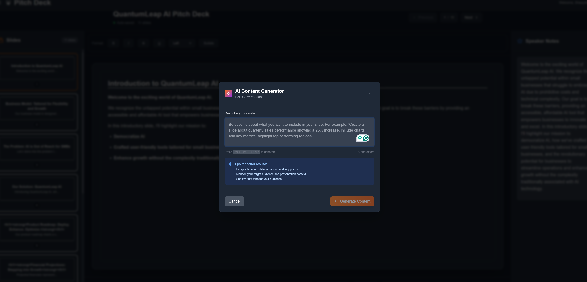
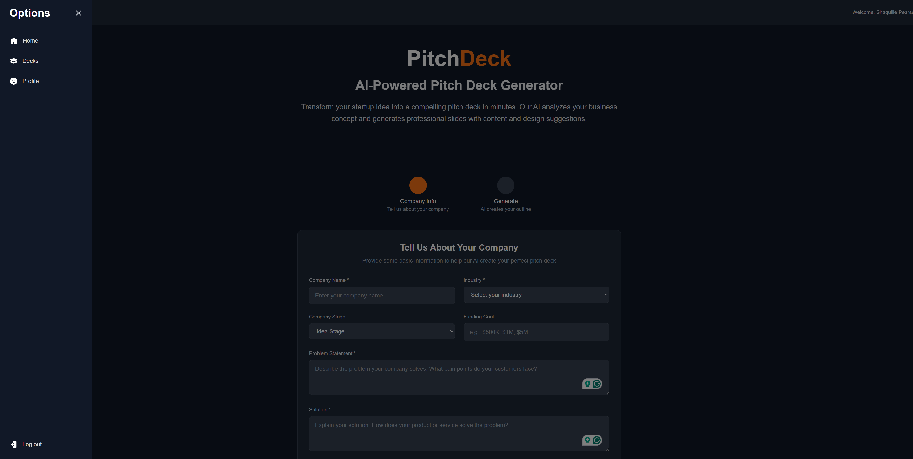

###  Overview (IN PROGRESS)
This is an **AI-powered pitch deck generator**, a tool designed to streamline pitch deck creation. 
It uses AI to generate and customize pitch presentations.

---

### Key Features

* **AI Content Generation:** Uses the **OpenAI API** to generate initial pitch deck content based on user input.
* **Dynamic UI:** Allows for **drag-and-drop** slide reordering and dynamic editing.
* **Individual Slide Regeneration:** Users can regenerate content for a specific slide based on new instructions.
* **AI-Generated Speaker Notes:** Automatically creates speaker notes for each slide to assist with presentation delivery.
* **User Management:** Implements **Auth0** for secure user authentication and data persistence via a **PostgreSQL** database.
* **Export:** Saves pitch decks in **PowerPoint (.pptx)** format.

---

### Screenshots

### Stack

* **Frontend:** **Next.js** and **Tailwind CSS** for the frontend.
* **Backend:** **NestJS** microservices handle API requests and interact with the **OpenAI API**.
* **Database:** **PostgreSQL** for data management and persistence.
* **Authentication:** **Auth0** for user authentication and authorization.

---

### Todo
* Improve formatting
* Implement the save to PPTX function
* Incorporate AI-generated images
* Improve responsiveness
* Sanitize free-form prompts for regenerating individual slides
* Version control
* Improve progress indicator
* Add keyboard shortcuts
* Add a color palette
